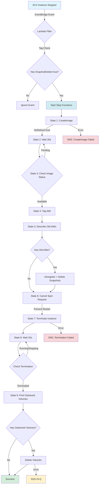

# AMI Lifecycle Workflow Diagram



## State Machine Details

### State 1: CreateImage
- **Service**: EC2 CreateImage API
- **Parameters**: InstanceId, Name, NoReboot=true
- **Retry**: 3 attempts, exponential backoff (30s, 60s, 120s)
- **Catch**: SNS notification → Fail
- **Duration**: 30-60 minutes for 100GB volume

### State 2-3: Wait for Image Available
- **Service**: EC2 DescribeImages API
- **Wait**: 30-second intervals
- **Choice**: Loop until state = 'available'
- **Timeout**: 2 hours (state machine timeout)

### State 4: Tag AMI
- **Service**: EC2 CreateTags API
- **Tags**: Name (from instance), SnapAndDelete=true, SourceInstance, CreatedBy
- **Purpose**: Enable filtering for cleanup

### State 5: Describe & Delete Old AMIs
- **Service**: EC2 DescribeImages, DeregisterImage, DeleteSnapshot
- **Filter**: Same SourceInstance tag, exclude current AMI
- **Action**: Deregister AMI + delete associated snapshots
- **Retention**: Keep only latest AMI per instance

### State 6: Cancel Spot Request
- **Service**: EC2 CancelSpotInstanceRequests API
- **Purpose**: Prevent persistent spot request from restarting instance
- **Retry**: 3 attempts with 10s, 15s, 22.5s intervals
- **Catch**: Continue on failure (non-spot instances)

### State 7: Terminate Instance
- **Service**: EC2 TerminateInstances API
- **Retry**: 3 attempts, exponential backoff (15s, 30s, 60s)
- **Catch**: SNS notification → Fail
- **Critical**: Must succeed to prevent resource leak

### State 8-9: Wait for Termination
- **Service**: EC2 DescribeInstances API
- **Wait**: 20-second intervals
- **Choice**: Loop until state = 'terminated'
- **Purpose**: Ensure volumes detached before deletion

### State 10: Delete Orphaned Volumes
- **Service**: EC2 DescribeVolumes, DeleteVolume
- **Filter**: status=available, tag:SnapAndDelete=true
- **Retry**: 5 attempts, exponential backoff (1m, 2m, 4m, 8m, 16m)
- **Catch**: Send to SQS DLQ for manual intervention

## Execution Flow Timeline

```
Time    State                         Action
------  ----------------------------  ----------------------------------
00:00   CreateImage                   Submit AMI creation request
00:01   WaitForImage                  Sleep 30s
00:31   CheckImageStatus              Query image state (pending)
00:31   WaitForImage                  Sleep 30s
...     [Loop continues]              Check every 30s
45:00   CheckImageStatus              Query image state (available)
45:00   TagAMI                        Apply tags to AMI
45:01   DescribeOldAMIs               Find previous AMIs
45:02   DeregisterOldAMIs             Remove old AMIs (if any)
45:03   DeleteOldSnapshots            Remove old snapshots
45:04   CancelSpotRequest             Cancel spot request
45:05   TerminateInstance             Terminate instance
45:06   WaitForTermination            Sleep 20s
45:26   CheckTerminationStatus        Query instance state (shutting-down)
45:26   WaitForTermination            Sleep 20s
45:46   CheckTerminationStatus        Query instance state (terminated)
45:46   DescribeOrphanedVolumes       Find available volumes
45:47   DeleteVolume                  Delete orphaned volumes
45:48   Success                       Workflow complete
```

## Error Handling Paths

### CreateImage Failure
```
CreateImage → Error
  ↓
Retry 3x (30s, 60s, 120s)
  ↓
Still fails?
  ↓
SNS Notification
  ↓
Fail State (preserve instance)
```

### TerminateInstance Failure
```
TerminateInstance → Error
  ↓
Retry 3x (15s, 30s, 60s)
  ↓
Still fails?
  ↓
SNS Notification
  ↓
Fail State (AMI created, instance may be running)
```

### DeleteVolume Failure
```
DeleteVolume → Error
  ↓
Retry 5x (1m, 2m, 4m, 8m, 16m)
  ↓
Still fails?
  ↓
Send to SQS DLQ
  ↓
Continue (volume orphaned but trackable)
```

### CancelSpotRequest Failure
```
CancelSpotRequest → Error
  ↓
Retry 3x (10s, 15s, 22.5s)
  ↓
Still fails?
  ↓
Catch → Continue
  ↓
Workflow continues (non-spot instance or already cancelled)
```

## Idempotency Mechanism

```
EventBridge Event
  ↓
Lambda Filter
  ↓
Generate execution name: ami-creation-{instanceId}-{timestamp}
  ↓
StartExecution(name=..., input={...})
  ↓
Step Functions
  ↓
Check if execution name exists?
  ├─ Yes → Reject with ExecutionAlreadyExists error
  └─ No → Start new execution
```

## Resource Tagging Strategy

### Instance Tags (Launch Template)
```json
{
  "SnapAndDelete": "true",
  "Name": "GamingInstance/g4dn.xlarge"
}
```

### Volume Tags (Launch Template)
```json
{
  "SnapAndDelete": "true",
  "Name": "GamingInstance/g4dn.xlarge"
}
```

### AMI Tags (Step Functions)
```json
{
  "SnapAndDelete": "true",
  "SourceInstance": "i-0123456789abcdef0",
  "CreatedBy": "AmiLifecycleWorkflow",
  "Name": "GamingInstance/g4dn.xlarge"
}
```

## Monitoring Queries

### CloudWatch Logs Insights - Lambda Filter
```
fields @timestamp, @message
| filter @message like /Started Step Functions/
| stats count() by bin(5m)
```

### CloudWatch Logs Insights - Failed Executions
```
fields @timestamp, @message
| filter @message like /error/ or @message like /fail/
| sort @timestamp desc
| limit 20
```

### List Recent Executions (AWS CLI)
```bash
aws stepfunctions list-executions \
  --state-machine-arn <arn> \
  --status-filter RUNNING \
  --max-results 10
```

### Get Execution History
```bash
aws stepfunctions get-execution-history \
  --execution-arn <execution-arn> \
  --max-results 100
```
